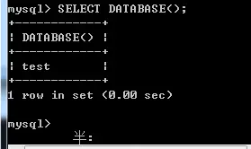
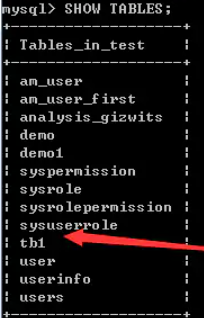
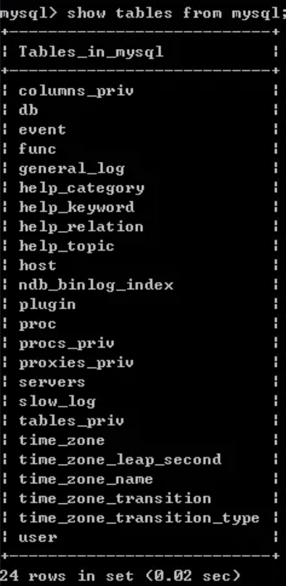
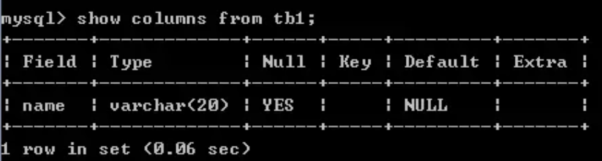

# 1.时间函数
* `NOW()`
* `CURRENT_TIMESTAMP()`
* `UNIX_TIMESTAMP()`
* `CURRENT_DATE()`
* `CURRENT_TIME()`
* `FROM_UNIXTIME()`
* `UNIX_TIMESTAMP()`
* `DATE_FORMAT(date, '%Y-%m-%d')`
* `DATE_ADD()`
* `DATE_SUB()`
* `DATEDIFF()`
* `TIMESTAMPDIFF()`
* `WEEKDAY()`从0开始计数, 输出周几
## 1.1 当前日期时间查询函数: 
1. 当期日期+时间:`NOW(), CURRENT_TIMESTAMP()`
* `select NOW()` —— `2021-05-17 17:34:35`
* `select CURRENT_TIMESTAMP()——2021-05-17 17:35:41`

2. 当前UNIX时间戳: `UNIX_TIMESTAMP()`
* `select UNIX_TIMESTAMP()
-- 1621244726`

3. 当前日期：`CURRENT_DATE()`
* `select CURRENT_DATE() -- 2021-05-17`

4. 当前时间：`CURRENT_TIME()`
* `select CURRENT_TIME()
-- 17:42:33`

## 1.2 日期时间转换函数:
1. 对于当前UNIX时间戳转换为北京时间：`FROM_UNIXTIME()`
* `select FROM_UNIXTIME(UNIX_TIMESTAMP())
-- 2021-05-17 19:05:38`
* `select FROM_UNIXTIME(UNIX_TIMESTAMP(),'%Y-%m-%d')
-- 2021-05-17`
2. 北京时间转换为时间戳：`UNIX_TIMESTAMP()`
* `select UNIX_TIMESTAMP('2020-01-01')
-- 1577808000`
* `select UNIX_TIMESTAMP('2020-01-01 08:30:50')
-- 1577838650`

3. 从时间中解析出年月日时间：`DATE_FORMAT(date,format)`

    注：date的参数可以包括时间（时：分：秒）,其转换的用法相同
* `select DATE_FORMAT('2021-01-01','%Y')
-- 2021`
* `select DATE_FORMAT('2021-01-01 08:30:50','%Y')
-- 2021`
* `select DATE_FORMAT('2021-01-01','%Y-%m')
-- 2021-01`
* **`select DATE_FORMAT('2021-01-01 08:30:50','%Y-%m-%d')
-- 2021-01-01`**
## 1.3 日期时间运算函数
1. 在某个时间的基础上加上或者减去某个时间：`DATE_ADD(date,INTERVAL expr unit)，DATE_SUB(date,INTERVAL expr unit)`
   `DATE_SUB(OrderDate,INTERVAL 5 DAY)`
2. 返回两个日期值之间的天数：`DATEDIFF(expr1,expr2))`

    返回的值=前一个日期-后一个日期
    `select DATEDIFF('2021-01-02','2021-01-01')
    -- 1`
3. 时间差函数：`TIMESTAMPDIFF(unit,datetime_expr1,datetime_expr2)`

    `unit`：天(`DAY`)、小时(`HOUR`），分钟(`MINUTE`)和秒(`SECOND`)，`TIMESTAMPDIFF`函数比`DATEDIFF`函数用起来更加灵活
* `select TIMESTAMPDIFF(day, '2021-01-01 08:30:00', '2021-01-02 10:30:00')
-- 1`
* `select TIMESTAMPDIFF(hour, '2021-01-01 08:30:00', '2021-01-02 10:30:00')
-- 26`

# 2.基础语句
1. 插入语句`insert into`   
    `insert into student(name,age) values ('李四',21)`
2. 更新数据`update-set`  
   `update Student set age=22 where name='张三'`

3. 删除行`delete`  
    `delete from Student where name='李四'`

4. 创建数据库`create database`  
   `create database Student`

5. 创建数据库中的表`create table`

    * 要写出字段名
    ``` SQL
        create table table_name
            (
            id int,
            name varchar（255）not null,
            age int
            primary key(id)
            )
    ```
    * [MySQL中的int(11)和varchar(255)含义](https://blog.csdn.net/qq_43778308/article/details/115538627)

6. 显示有的数据库`show database`
7. 打开数据库`use test`
8. 查询打开的数据库`SELECT DATABASE()`
    
9. 查看有的数据表`show tables`
    
10. 查看数据库中的所有数据库列表`show tables from mysql`
  
11. 查询数据表的结构`show columns from tb1`
    
12. 删除数据库或表`droptable Student/drop database Student`
13. 清空表中的数据`truncate table Student`
14. 修改字段, 删除或者添加修改`Alter table`
    * 删除字段, `drop`: `ALTER TABLE tbl  DROP i;`
    * 添加字段, `ADD`: `ALTER TABLE tbl ADD i INT`
    * 设定新增字段位置`first / after`
      * `ALTER TABLE tbl ADD i INT FIRST;`
      * `ALTER TABLE tbl ADD i INT AFTER c;`
    * [更多用法](https://www.runoob.com/mysql/mysql-alter.html)
# 3. 查询中常用的语句、函数以及方法名
1. 返回表的第一条数据`top 1 *`
2. 前百分之50 `top 50 percent *`

## 3.1 字符串匹配
`like` + 通配符
例: 返回Student表里名字以张开头的数据
`select * from Student where name like '张%' `
通配符大全:
1. `%` 匹配任意字符
2. `_`匹配一个字符
3. `[abc]`abc中任一字符
4. `[^abc]` `[！abc] `不在abc中的任意字符（1个）

## 3.2 多字段查询
`WHERE (Id+1, Num) IN (SELECT * FROM Logs) AND (Id+2, Num) IN (SELECT * FROM Logs`

## 3.3 条件查询
`IFNULL(COL, 0)`
# 4. 查询加速
**索引(列)**——使数据库应用程序可以更快地查找数据。用户无法看到索引，它们只能被用来加速搜索/查询。
**注释**——更新一个包含索引的表需要比更新一个没有索引的表更多的时间，这是由于索引本身也需要更新。因此，理想的做法是仅仅在常常被搜索的列（以及表）上面创建索引。
`CREATE INDEX PersonIndex ON Person (LastName DESC)`

# 5.视图
视图View是一种虚拟的表,**本身不保存数据**,内部封装了一条SELECT语句,数据来源于查询的一张或多张实际数据的表。
* 简单
视图可以将复杂的查询语句进行封装,用户使用时不需要关心表的结构、连接关系、筛选条件、分组和排序等等,只需要对视图进行简单的查询。
* 安全
创建视图时,可以筛选掉一些不希望用户看到的行和列,也可以给视图设置访问权限,让不同级别的用户看到不同的视图,从而提高数据库的数据安全性。
## 5.1 语法
* 创建视图: `create view视图名
    as`
* 使用视图: `SELECT`
  `select * from 视图名`
* 更新视图可能失败的情况:
  * 包含`distinct`
  * 有**聚合**函数
  * 有**`group by`** / `order by`
  * 有`union`
  * 有子查询

# 6. 字符串函数
* `CONCAT()`, 拼接字符串
  * 如: 百分号写法`concat( round( remain5 / user_count * 100, 2 ), '%' )`

# 7. 聚合函数
* `sum(col), avg(col), count(col), stddev(col), variance(col), max(col), min(col)`
* `percentile(col, p)`
* `GROUP_CONCAT(DISTINCT col ORDER BY col SEPARATOR ',')`

# 8.窗口函数
`over(partition by 分组列 order by 排序列 rows between 开始位置 preceding and 结束位置 following)`
* `CURRENT ROW`: 当前行
* `UNBOUNDED`: 顶点
  * `UNBOUNDED PRECEDING`: 起点
  * `UNBOUNDED FOLLOWING`: 表示到后面的终点