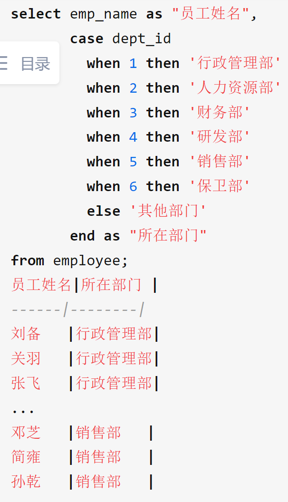

[可回收且低脂的产品](https://leetcode.cn/problems/recyclable-and-low-fat-products/submissions/)

* 单表条件查询：select 语句 select ... from ... where ... and ...
* group计算, sum一整个group?，如果没有sum输出组的第一个?sum()是组函数? 还有count()计数
* 改名`as` select event_day as day, emp_id, sum(out_time - in_time) as total_time
* 排序`order by` `order by event_day asc, emp_id desc`
* 分组`group by event_day, emp_id`
* 内连接 `表1 inner join 表2 on 表1.字段 = 表2.字段`
* ？ 多表查询内连接条件用`having 条件` 
* `where`, `having`, `on`的区别
    > 执行顺序上，where先于having执行。而且having往往和group by连用，where则不能和group by连用。三者的执行顺序为where>group by>having。
    最重要的区别：having可以和count、sum、avg、max、min等聚合函数一起使用，而where则不能
    `WHERE`子句在`GROUP BY`分组和聚合函数之前对数据行进行过滤；
    `HAVING`子句对`GROUP BY`分组和聚合函数之后的数据行进行过滤。
     因此，WHERE子句中不能使用聚合函数。
     在执行WHERE子句时，还没有计算聚合函数
     对于内连接（inner join）查询，WHERE和ON中的过滤条件等效；
    对于外连接（outer join）查询，ON中的过滤条件在连接操作之前执行，WHERE中的过滤条件（逻辑上）在连接操作之后执行。
    另外一种情况下不能使用having却能使用where的情况是：条件字段名称不在select的里面
    最重要的区别是having可以和聚合函数搭配使用，如常用的groupby

* 主键是什么？
* 计数函数`count()`去掉重复的, `distinct`, 即`count(distinct 字段)`
* 连接：
  * 内连接:  `表1 inner join 表2 on 表1.字段 = 表2.字段`
    > 交集, 取条件中两表都有的行
    不会读取两个表中任意一个表所有的数据
  * 外连接, 左外连接 `表1 left join 表2 on 表1.字段 = 表2.字段`
    >MySQL left join 与 join 有所不同。 MySQL LEFT JOIN 会读取左边数据表的全部数据，即使右边表无对应数据。
    如果左表某一行对应右表很多行, 左连接会扩充左表
    where -> group by -> having
* 更新表: `update 表名 set 字段=if(条件, 条件成立的返回值, 条件不成立的返回值)`
* 联合查询`union`, 在几个`select`中间写一行`union all`就自动联合两个表。
  * 如果不用`union all`而直接用`union`, 会把合并后的数据去重处理
* 判断空值要用`is`,`is null`, `is not null`
* 重构表: `select`里面直接写值，相当于把   那一列都写成这个值, 不`as`写列名，那这个值就自动成为列名
* 条件不等于`!=`, 计数`a%2 != 0`
* 子查询、嵌套查询：子查询，也称为嵌套查询或子选择，是`SELECT`嵌入在另一个SQL查询的 `WHERE` 或`HAVING`子句中的查询。子查询返回的数据由外部语句使用，与使用文字值的方式相同.
  >子查询必须始终出现在括号内。
  >* 子查询必须只返回一列。这意味着不能在子查询中使用SELECT *，除非所引用的表只有一列。如果目的是行比较，可以使用返回多列的子查询。
  >* 只能使用返回多个值运算符（例如`IN` 或 `NOT IN`运算符）的多行的子查询
  >* 子查询不能是UNION。只允许一个SELECT语句。
* 去重`group by`和在select后加`distinct`都可以去重
* 没看懂的窗口函数`min() over(partition by 列)` `select distinct player_id,min(event_date) over(partition by player_id) as first_login from Activity`
* [586. 订单最多的客户](https://leetcode.cn/problems/customer-placing-the-largest-number-of-orders/)
* `limit`分表limit 1只输出第一行
* `if` and `case`
  * case就是多项if
  * if (expr, true_value, false_value)
  * case when expr then true_value else false_value end
  * 