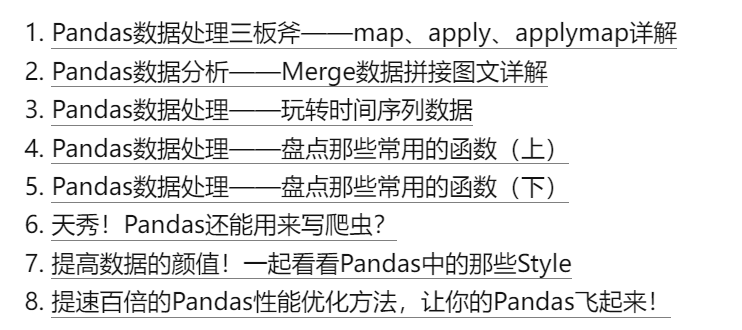
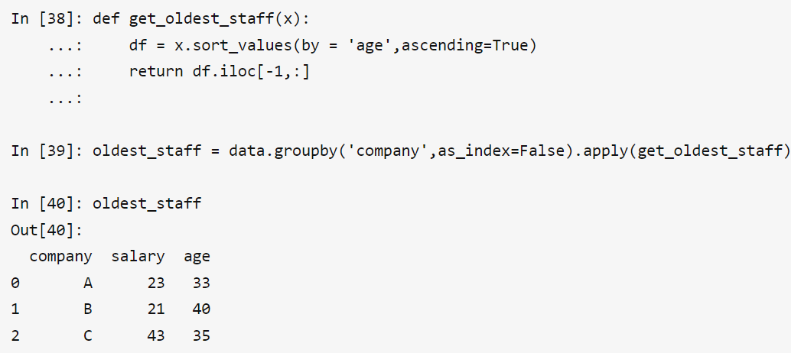
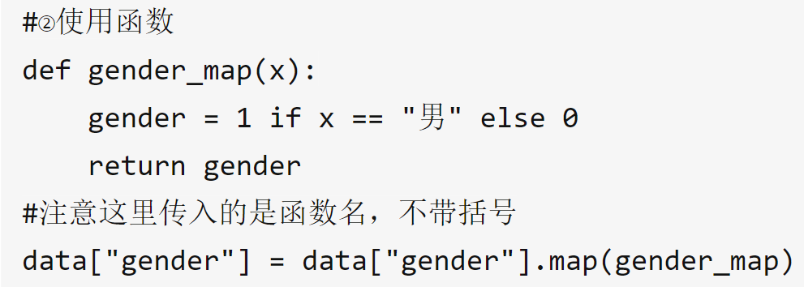

# 0.基础:[Pandas最详细教程来了！](https://mp.weixin.qq.com/s/FIK78HxHcxZLOBJarpmZhg)
* 删除列: `del df['D']`
* 添加行: `df.append(), df.loc['行索引']` 
  * `new_df=pd.DataFrame({'A':'new','B':4000,'C':40},index=['d'])
    df=df.append(new_df)`
   * `df.loc['e']=['new2',5000,50]`
* 合并另一个df的列`df.join(df2)`——相当于对df左外连接
  * `df.join(df2,how='outer')`外连接——并集
  * `left`（默认值，调用方法的对象的索引值）
  * `right`（被连接对象的索引值）
  * `inner` 交集, 内连接
* `date_range()`方法
  * `dates=pd.date_range('20160101',periods=8)`
* 累计求和`df.cussum()`
* 按某一列排序`df.sort_values('A')`
* 按索引排序`df.sort_index(ascending=False)`
* 如何返回一行df而不是series`df.loc['20160102':'20160102',['A','C']]`
* 筛选`df[df.A>0]`
  * `df[df>0]`不满足条件的为`NAN`
* `loc`的时候，x索引和y索引都必须是标签值
* `df.ix[]`混合索引`df.ix[1,'E'] = 3`
  * 会优先假设数字为标签索引，而不是位置索引

# [一个特别好的文章](https://zhuanlan.zhihu.com/p/101284491)

# 1.列操作
* 修改列名`.colums` `.rename()`
  1. `df.columns = ['A','B']`
  2. `df.rename(columns={'a':'A'})`

* 删除列`df = df.drop('列名', axis=1)`
* 列排序`df.sort_value('列', ascending=True)`
# 2.`Groupby`
## 2.1 基本语法
* 基本语句: `data.groupby("company", as_index=True)` -> 可以用list查看对象格式
* 聚合语法: `data.groupby("company").agg('mean')`
  * 不同列不同聚合方式——字典`data.groupby('company').agg({'salary':'median','age':'mean', '':自定义函数})`
  * 同列不同聚合方式`data.groupby('company').agg({'salary': ['median', 'mean']})`
* 聚合后结果映射回原表格
  1. 聚合计算后.to_dict()然后再.map到原表格
  2. `transform`: `group by`之后直接`transform('聚合方式')`

* 自定义聚合后`apply`函数——传入df输出一列
  * 

# 3.`map、apply、applymap`
## 3.1 `map`
1. 按字典映射`data["gender"] = data["gender"].map({"男":1, "女":0})`
2. 按函数映射

## 3.2 `apply`
```python
def apply_age(x,bias):
    return x+bias
​
#以元组的方式传入额外的参数
data["age"] = data["age"].apply(apply_age,args=(-3,)) # 单列不用指定轴axis = 1
```
* `axis`
  * `axis=0`输入的`series`是一列, 否则是一行

## 3.3 `applymap`
针对所有值, 所有列
* 保留两位小数: `df.applymap(lambda x:"%.2f" % x)`

# 4.[`merge`数据合并](https://zhuanlan.zhihu.com/p/102274476)
基本语法: `df_1.merge(df_2, how, on)`
## 内连接、外连接
内连接: `df_1.merge(df_2,how='inner',on='userid')`
左外: `df_1.merge(df_2,how='left',on='userid')`
外连接: `df_1.merge(df_2,how='outer',on='userid')`

# 5.常见函数
## 5.1 增
1. 填充缺失值: `data.fillna(method='bfill')`
   * `value`: 用来填充缺失的值
   * `method: （{‘backfill’, ‘bfill’, ‘pad’, ‘ffill’, None}, default None）`
   * `inplace = False`: 是否作用于原对象
## 5.2 查
1. 集合查找: `data.loc[data['company'].isin(['A','C'])]`
2. 条件筛选并替换: `data['salary'].where(data.salary<=40,40)`
3. 打印基本信息(数据类型, 内存大小、非空值个数) `data.info()`
4. 描述性统计汇总(均值, 标准差, 分位数) `data.describe()`
5. 统计类别数量: `data['company'].value_counts()`
   * `normalize = False`返回各类的占比
   * `sort = True`
   * `ascending = False`
6. 判断是否缺失: `data.isna()`
   * 查看列是否又缺失: `data.isna().any()`
## 5.3 改

1. 修改数据类型: `data["age"] = data["age"].astype(int)`
2. 修改列名: `data.rename(columns={'age':'number'},inplace=True)`
3. 设置索引: `data.set_index('number',inplace=True)`
4. 重置索引: `data.reset_index(drop=True)`
5. 连续变量离散化区间: 
   1. 指定区间个数: `pd.cut(data.salary,bins = 5)`
   2. 指点间断点: `pd.cut(data.salary,bins = [0,10,20,30,40,50])`
   3. 指定区间名字: `pd.cut(data.salary,bins = [0,10,20,30,40,50],labels = ['低','中下','中','中上','高'])`
6. 连续变量离散化区间(分位数版): `pd.qcut(data.salary,q = 3)`
7. 拼接: `pd.concat([data1,data2],ignore_index = False), axis=0`
   1. `ignore_index = True` 重置索引
8. 数据透视表`data.pivot_table(values = 'salary',index = 'company', columns = 'gender',aggfunc=np.mean)`
9. 按照索引排序: `data.sort_index(ascending=True, inplace = False)`
10. 按照某列排序: `data.sort_values(by='salary', ascending=False)`
## 5.4 删
1. 去重(`SQL`中的`distinct`): `data['company'].drop_duplicates()`
2. 删除列/字段: `data.drop(columns = ['gender'])`
3. 删除缺失值: `data.dropna()`

# 6. 时间数据类型
## 6.1 基础语法
1. 转换为`datetime`格式: `data["trade_date"] = pd.to_datetime(data.trade_date)`
2. 设置为索引: `data1 = data.set_index("trade_date")`
3. 时间索引查找: `data1.loc["2019-06"].head()`
   * 可以查找出来所有6月的数据
   * `data1.loc["2019-06":"2019-08"].tail()`

4. `datetime`所有属性:
   1. `date`, `year`, `month`, `day`
   2.  `time`, `hour`, `minute`, `second`
   3.  `dayofyear`, `weekofyear`
   4.  `weekday`, `weekday_name`
   5.  `quarter`季度
   6.  `is_leap_year`是否闰年

## 6.2 采样`resample`
基于时间的`groupby`
1. 降采样
   * 求每季度的平均收盘价
   * 日到季度——高频到低频——降采样
   * `data.resample('Q',on='trade_date')["close"].mean()`
   * `Q,M,W,ND(N天),H,T(分)`
2. 升采样
   * 会产生缺失值, 然后再填充
   * `example.resample('6H').asfreq()`
   * `.asfreq()`会返回新频率下的结果
   * 向前填充(按时间顺序向前填充): `example.resample('6H').ffill()`
   * 向后填充: `example.resample('6H').bfill()`