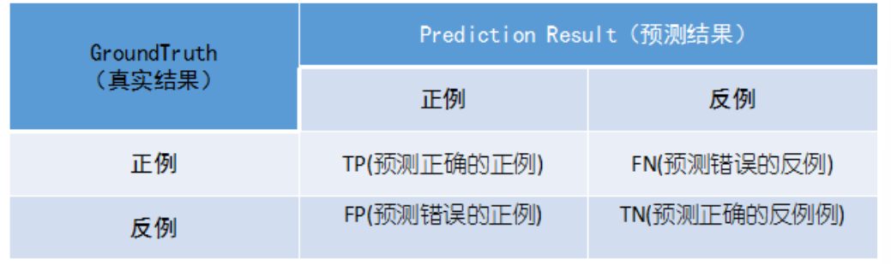

# 简介
[推荐系统算法综述](https://www.zhihu.com/search?type=content&q=%E6%8E%A8%E8%8D%90%E7%B3%BB%E7%BB%9F%E7%AE%97%E6%B3%95)

人们提出了推荐系统（与搜索引擎对应，人们习惯叫**推荐系统**为推荐引擎）。当我们提到推荐引擎的时候，经常联想到的技术也便是**搜索引擎**。
* 推荐引擎
* 搜索引擎

## 评测指标
推荐系统根据推荐任务的不同通常分为两类：**评分预测**与**Top-N列表推荐**。在这里主要根据这两者来分别讨论评测指标。
### 1评分预测任务
预测特定用户对于没有产生过行为的物品能够打多少分。RMSE、MAE
* RMSE: 加大了对预测不准的用户物品评分的惩罚(平方项的惩罚),因而对系统的评测更加苛刻
* MAE: 同时如果评分系统是基于整数建立的(即用户给的评分都是整数),那么对预测结果取整会降低MAE的误差。
评分预测只能适用于小部分的场景，比如对于**电影，书籍的评分**，
### 2Top-N列表推荐
其实**Top-N推荐**更加符合现在的需求，给用户提供一个**推荐的列表让其进行选择**。Top-N推荐一般通过**准确率与召回率来进行衡量**。其中令**R(u)是根据用户在训练集**上的行为给用户作出的推荐列表（指的是预测的推荐列表）,而**T(u)是用户在测试集**上的行为列表（指的是真实的列表GroundTruth）,在这笔者总是容易混淆两者的含义.
* Accuracy: 对不平衡数据的评价能力有限，比如甘肃半干旱地区的降水(召回率就会更好一些)
* 准确率precision——判断出来时阳的东西如果不是阳的后果很严重——正常邮件给人当垃圾邮件丢了。
* 召回率recall——阳的都得判断出来、如果判断不出来后果很严重(癌症)。
* f1score调和平均——新冠肺炎疫情
* 
* AUC对正负样本比例不敏感
  * AUC来评估二分类模型的性能。
  * 这个问题的本质原因，在于横轴FPR只关注负样本，与正样本无关；纵轴TPR只关注正样本，与负样本无关。所以横纵轴都不受正负样本比例影响，积分当然也不受其影响。
  * 如果我们主要关心对正类的预测准确性，ROC就不能很好的衡量【因为不随着样本类别分布发生太大变化】
  * 正是因为AUC不敏感，所以我们才要采用AUPRC??。
  * AUC可以理解为，**随机抽取一个正样本A，随机抽取一个负样本B，分类器将A判断为正的概率大于分类器将B判断为正的概率的可能性**
  * 根据上述概率解释，AUC实际上在说一个模型把正样本排在负样本前面的概率！ 所以，AUC常用在排序场景的模型评估，比如搜索和推荐等场景！

# 召回
