# [ABtest和假设检验、流量分配](https://zhuanlan.zhihu.com/p/36384858)

## 来源以及本质

来源: 假设检验
本质: 同质样本组的对照实验
* 对某个组进行**某方面的改动**，来看这个改动会不会对我们关心的**核心指标**有显著的影响
* 如果p值足够的小就推翻原假设，证明有显著的影响

## AB实验中的辛普森悖论

定义:
* 在某种条件下, 我们关注的两组数据, 分组讨论时都会满足同样的性质
* 可是, 当我们把两个子数据集合并并观察整体时就会得出截然相反的结论

辛普森悖论产生的原因
* 我们把值与量, 两个纬度的数据合并成了值, 一个维度去进行讨论
* 在划分子数据集的时候, 并没有对流量进行一个合理的分割, 导致我们所选取的实验组**并不具有一定的代表性**

会造成的损失
* 用百分之一的流量去判断功能上线后会提升带来体验，但是实际没有

避免方法
* 对**样本量进行合理的分配**
* 保证样本量具有相似的特征, 且都能代表总体的特征
* 在日常的AB测试中，找到根本变量之后，要设置一定比例的实验组，如果仅仅以2%的数据做实验，最终发现效果很好，但很可能会导致全部上线之后效果非常差，这就是「量变引起质变」的道理。

实际例子: 要判断用户参与活动后领取福利的入口放在哪里比较合适, 更容易被用户点击
* 实验组和对照组圈定的用户都一定要是**参与活动的用户**, 不能选择整体的大盘用户。

## AB实验的样本量如何计算

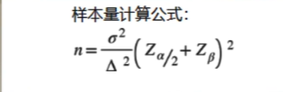
* $\sigma$选取数据标准差
* $\Delta$两组数据的差值

样本量的确定主要是为了**避免第二类错误**

样本量计算器: Evans's Awesome A/B Tools
* `baseline rate`原来点击率的多少
* `minimum defectable effect`判断精度的最低要求
  * 10%, 检测出的差别只要达到10%即可
  * 高精度要求, 样本量会增加
* `significance level $\alpha$` 第一类错误概率, 显著性水平
* `statistic power $1-\beta$` 第二类错误概率

## 互联网业务中遇到的两类错误

第一类错误: 一个功能的改动, 本来不会给我们带来收益, 但是我们误认为可以带来收益
第二类错误: 一个好的产品, 本来可以带来收益, 但是由于我们统计的误差, 我们认为不会给我们带来收益

其中第一类错误更严重, 我们宁愿砍掉4个好的产品, 也绝对不能让一个坏的产品上线, 日活, 或者留存提升一个百分点都是很牛的提升, 很难, 但是如果想让留存掉一个百分点的话可能就是一瞬间的事情

* 辛普森悖论
  * 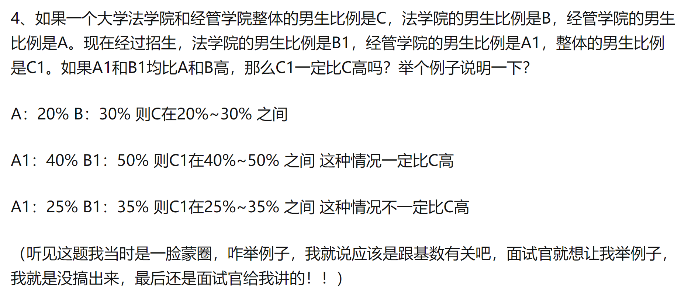
* 费米问题
  * 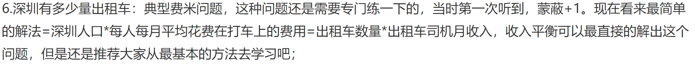

## ABtest流程 

1. 和PM(产品经理)沟通确定**改动点**在哪里?
2. 分析师确认**观测指标**
3. 确定**实验流量比例**
4. 发邮件确认实验配置, 让开发同学正式开始实验
5. 小流量开启灰度实验——验证功能不会造成特别极端的影响
6. **正式实验一周**整理实验数据，产出实验报告, 返回到开发同学那里确认我们的收益是显著的

## ABtest-tricky问题

1. 实验结果统计显著, 实际不显著, 为什么? 
   1. **样本量过大**，导致和总体差异过小, 这样我们如果发现一个很小的差别, 在统计上显著, 在实际中也可能会不显著
   2. 主观上(性能上)比如启动时间优化0.0001秒, 感知上不显著, 没有太大实际意义
2. 实验统计不显著, 如何判断收益
   1. 将指标拆分成每一天去观察, 如果说**变化曲线**每一天实验组都高于对照组, **统计不显著, 但仍然可以优于, 可以上线**
3. 关注的指标显著正向, **一定**可以上线么? 
   1. 不一定, 一个方面的优化可能会导致另一个方面的**劣化**（页面丝滑程度——等待时间）
   2. 可能对广告或者**其他部门导致负面影响**
   3. **一定要综合评估各方面的变动**, 同时对于**收益和损失**来做一个评估

## 变式问题

如何验证显著收益  
AB实验成本高:
  设置开关, 来看用户倾向性

# 假设检验

**假设检验**，也称为**显著性检验**，通过**样本的统计量**来判断与**总体参数**之间是否存在差异（**差异是否显著**）。即我们对总体参数进行一定的假设，然后通过收集到的数据，来验证我们之前作出的假设（总体参数）是否合理。在假设检验中，我们会建立两个完全对立的假设，分别为原假设H0与备择假设H1。然后根据样本信息进行分析判断，**是选择接受原假设还是拒绝原假设。**
* 假设检验基于“**反证法**”。首先，我们假设原假设为真，如果在此基础上，得出了违反逻辑与常理的结论，则表明原假设是错误的，我们就接受备择假设。
* 假设检验遵循“**疑罪从无**”的原则，接受原假设，并不代表原假设一定是正确的，**只是没有充分的证据，证明原假设是错误的**。

## P值和显著性水平$\alpha$

一句话解释p值: p值是在假定原假设为真时, 得到与样本相同或者更极端的结果的概率, 描述样本与原假设的相悖程度  

### 缺点

光从p值中, 我们只能知道样本与假设有没有差别, 却很难知道到底有多少差别, 比如一款降压药, 他只能让病人的血压降低1毫米汞柱是一个微乎其微的效果, 但是在样本量很多的情况下它还是会被判断出有差别  

解决: 不仅仅需要给出P值, 还需要给出相应的效益大小(均值差, 回归系数等)以及置信区间

P值是犯第一类错误的实际概率，而α是犯第一类错误的最大概率吗？当P<α时，就说明“错杀好人”的概率很小，几乎可以证明“没有杀错人”，也就是没有犯错，拒绝H0是对的，这时候就接受H1；当P>α时，就说明”错杀好人“的概率很大，可以证明“杀错人”了，也就是犯错了，不应该拒绝H0，应该接受H0
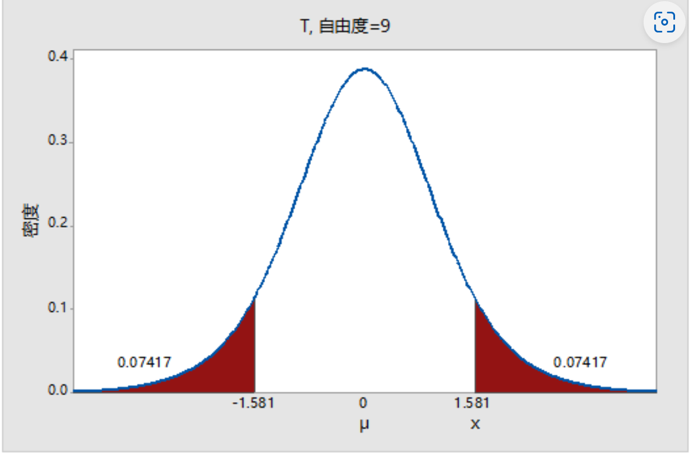

## 常见假设检验
1. Z检验
  * 已知总体方差(不知道用样本代替，即为t检验)
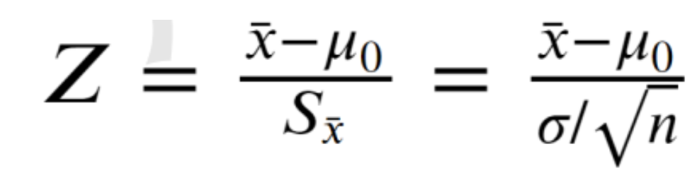
  * 比较两个总体的均值是否有显著性的差异
  * 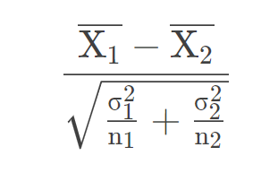
2. t检验
  * 基于T分布(大样本接近正态分布)
  * 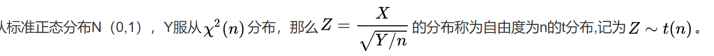
  * 随着样本容量的增大（样本数量≥30），t分布逐渐接近于正态分布。此时，t检验也就近似于Z检验。
  * 独立样本T检验统计量
    *  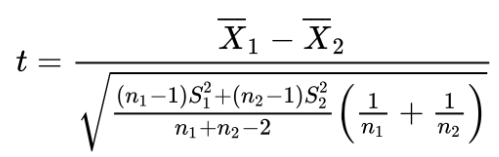
    *  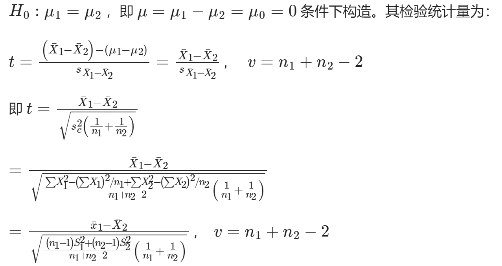
 *  方差不一样的近似t检验
    *  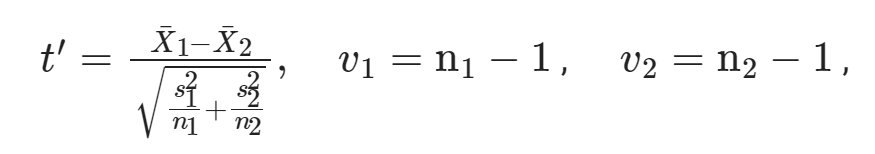

# 费米问题
[费米问题（估算问题）实例大汇总(转)](https://zhuanlan.zhihu.com/p/130831629)
1. 请你估算一下一家商场在促销时一天的营业额？
2. 胡同口的煎饼摊一年卖多少个煎饼？
3. 预测国内资讯类APP的DAU天花板？
4. 试估算中国K12课外英语辅导的市场？
5. 芝加哥有多少个调音师？
6. 北京有多少个加油站？
7. 北京有多少辆出租车？
8. 美国飞机的乘客数有多少？
9. 估算深圳市丰田汽车的数量？

# RFM模型

"通过RFM模型去实现**用户分群, 分析用户价值**"
经常被用于对老客户的召回, 如: 发邮件或者短信, 去对用户进行营销或者触达(发多了有可能招烦, 降低回复率以及召回成功率), 因此基于RFM的策略发出的短信会更有针对性, 可以提高响应率.

## 基本定义

主要通过**用户的价值**实现**用户分群**, 具体氛围3个方面:

1. R: `Recency`最近一次消费
   * 截止到统计时间, 最近的一次消费, 窗口末端一致, 需要往前移动不同的时间段
   * 影响因素: 网站的可记忆点, 用户本身的复购周期, 对于用户的曝光记录
   * 密切关联的行为: **复购**以及**留存**
2. F: `Frequency`交易频率
   * 用户对于商品的购买习惯, 品牌忠诚度等
   * 决定用户复购行为的本质: 商品所属品类本身, 有的商品属于耐耗品, 有的属于易耗品, 所以在进行**F值**的统计比较时, 需要**针对不同的品类去划分时间窗口**, **切忌进行跨品类的比较**
3. M: `Monetary`消费金额
   * 消费能力: 一个用户买的起多少
   * 对产品的认可度: 一个用户愿意买多少

## 用户八大类

参考视频: [付费才能看的知识点总结快来白瓢！|让你的RFM模型不一样|细节拉满才能脱颖而出](https://www.bilibili.com/video/BV1NT4y1d7Nm/?spm_id_from=333.999.0.0&vd_source=6410836f314e170bcf71b89c67ec8878)
| 用户类型     | R:最近交易 距离当天 天数(粘性) | F:累计单数(忠诚度) | M:累计交易金额(收入) | 对应货运圈的成员场景                               | 自己的理解                                                                                                                                                             |
| :----------- | ------------------------------ | ------------------ | -------------------- | -------------------------------------------------- | ---------------------------------------------------------------------------------------------------------------------------------------------------------------------- |
| 重要价值客户 | 大                             | 大                 | 大                   | RMF都很大, 优质用户, 需要保持                      | 还说啥呢, 完美人                                                                                                                                                       |
| 重点唤回客户 | 小                             | 大                 | 大                   | 交易金额和交易次数都很大, 但是最近无交易, 需要唤回 | 之前买过很多之前东西, 需要想办法赶快舔回来                                                                                                                             |
| 重要深耕客户 | 大                             | 小                 | 大                   | 交易金额大贡献度高, 且最近有交易, 需要重点识别     | 最近刚刚大撒币的土豪                                                                                                                                                   |
| 重要挽留客户 | 小                             | 小                 | 大                   | 交易金额大, 潜在的有价值客户, 需要挽留             | 是那种**以前**路过网站大撒过币的土豪, 撒完就走, 要重点留住                                                                                                             |
| 潜力客户     | 大                             | 大                 | 小                   | 交易次数大, 且最近有交易, 需要挖掘                 | 喜欢品牌但是但是不愿意花大钱, 这种比较有潜力, 诱导他去买更值钱的货物. 比如我对华为: 买了耳机, 手环. 但是不愿意买手机电脑平板, 如果此时有人对我循循善诱, 我就很可能买了 |
| 新客户       | 大                             | 小                 | 小                   | 最近有交易, 接触的新客户, 有推广价值               | 新用户还比较未知, 宁错杀不放过, 推广一下看看潜力                                                                                                                       |
| 一般维持客户 | 小                             | 大                 | 小                   | 交易次数多, 但是贡献不大, 一般维持                 | 说起来我也很久没买华为便宜货了, 我应该算一般维持用户                                                                                                                   |
| 流失客户     | 小                             | 小                 | 小                   | FM值底过平均值, 最近也没有交易, 相当于流失         |

还可以根据单个指标单独分类, 比如Recency一定程度上反应用户在生命周期所处的不同阶段:活跃用户, 沉默用户, 休眠用户, 流失用户. 再分别采取不同的策略(差异化运营).
这些策略可能包含: 营销信息的推送密度, 推送时机, 优惠力度等等

## 其他问题

1. 消费金额(或者跨度比较大的字段)如何划分(是一种离散化的方式)?
   * (货运中)客单价的一般, 恰好符合28原则
   * 自己做可以: **①等距分桶(适合样本分布较为均匀的分桶), ②等频分桶(分位数分桶), ③模型分桶(树模型这种非线性模型天生具有对连续型特征切分的能力，利用特征分割点进行离散化)**
2. 取值高低如何判断(评判标准)?
   * 工作上一般有一个既定的数值作为标准benchmark, 根据以往经验得到, 或者是行业内默认的一些基准
   * 平均值或者中位数
3. 三个属性放到一起如何综合评估, 从而进行更细维度的用户质量划分?
   * 数据归一化
4. 三者的取值是否存在权重上的差别?
   * 行业不同, 侧重点不同, 可以根据业务经验直接给出权重(化妆品日用品rf权重高于m, 视频或者内容类平台f更重要), 节约时间成本
   * AHP(analytics hierarchy process)层次分析法: 一种定量和定性结合的决策方法
     1. 搞清楚要解决的问题, 影响因素以及备选方案
     2. RFM构造两层的层次分析模型就够了, 因为RFM本身就是比较具体的指标
     3. 构造判断矩阵(存在**经验因素**在)ab两个因素同等重要取1, a比b稍微重要取3, a比b明显重要取5
     4. 层次排序以及一致性检验
5. 如何确认这三者取值或评分合理?

## RFM如何做出彩

* 注重细节: 技术细节, 业务细节, 并**凝练**成为放到简历上的关键点

# 指标体系

## 构建思路
参考: [大厂数分敲门砖！去哪做数据分析都逃不过的指标体系搭建 | 来看看不同等级的回答思路](https://www.bilibili.com/video/BV1uW4y1n7WA/?spm_id_from=333.999.0.0&vd_source=6410836f314e170bcf71b89c67ec8878)

指标的作用: 作为数据的载体, 用来传递业务信息, 一个指标反应的是一个单点的业务现状, 一套指标反应的是一个面上的业务现状

搭建有效的指标体系:

1. 确认**业务目标**, 或者是这套体系所要作用的对象, 所要解决的问题(WHY)
2. 搭出来的指标体系消费方是谁(确定一级指标?)(WHAT, WHO)
   * UG(User Growth 用户增长)更关注DAU/留存一类的直接用户侧挂钩的指标内容
   * 老板更关注GMA(Gross Merchandise Volume网站成交金额)等营收相关的内容
   * 产品更专注功能相关的使用指标
3. 细化落实到具体的执行侧, 让对应的业务方看完这个指标体系**可以明白到底能做什么**, 不同的子动机就决定了对于大指标的不同拆解方式(二, 三级指标)(WHEN, HOW)
   * 监控变化
   * 应对异动
   * 持续提升
   * 评估表现

备注: 验证是否合理是否有遗漏 -> 5W1H(`what`, `why`, `when`, `where`, `who`, `how`)

AARRR, OSM模型

关键点: ①深入产品本身, ②拆解业务模块, ③结构化的填充血肉

例: 网易云的发展情况

1. 搭框架: 规模, 行为, 营收, 质量
2. 根据类型拆解到: 内容, 社区, 商业化, 创业者中心, 直播

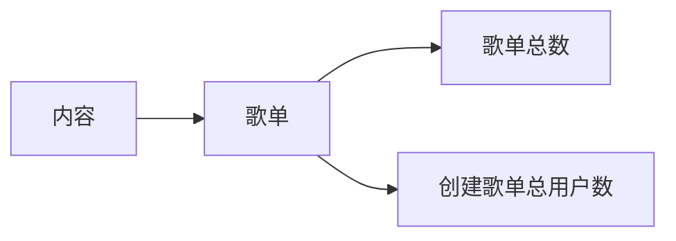

## AARRR

* acquisition 拉新相关
  * 曝光, 点击, 下载, 注册
    * 对应: 曝光量, 点击人数, 下载人数. 新增注册用户数
    * 漏斗: 转化率, 下一环节人数 / 上一环节人数
      * 点击率, 下载率, 转化率
  * 获客成本(收费模式):
    * CPM(cost per mile 千人展示成本)
      * 某个广告让1000人所看到需要花费的费用, 按展示量曝光量来收费
      * 视频中的图片广告
      * 门户网站的优质广告位
    * CPC(cost per click 每点击一次广告所产生的费用)
      * 更加精确
    * CPA(cost per action 对约定好的行为进行收费)
      * 注册下载互动购买
      * 更强调广告效果
* activation 活跃相关
  * DAU(Daily active user 日活用户数)
  * WAU(周活)
  * MAU(月活)
    * **日活和月活**是分别从微观和宏观两个角度去体现用户的**粘性**以及用户的**衰退服务周期**
  * 用户每月访问app平均天数 = (DAU / MAU) * 30
    * 越高粘性越好 -> 流失率底 -> 留存率高
  * 时长指标
    * 用户在线时长
    * app使用时长
    * 视频播放时长(均次播放时长和人均播放时长)
    * app启动次数(反应使用频率)
      * 冷启动/热启动
  * PV页面浏览量
  * UV独立访客数(指一天内访问某站点的人数)
* retention 留存相关
  * 留存率(长期留存/短期留存)
    * 短期留存: 反应APP能否迅速的把用户留下来
    * 长期留存(30/60): 反应留存下来的用户的稳定性
  * 用户生命周期
    * =当日留存率 + 次留率 + 3留率 + ...n留率
* revenue 变现(转化)相关
  1. **交易类(关注成交)**
     * GMV(gross merchandise volume 成交总额) 会包含已经拍下来但是还没有支付的订单金额
     * 销售收入
     * 付费用户数
     * 付费率
     * ARPU(upu)
       * (average revenue per user) 反应每个用户能给企业带来的平均收入是多少
       * 通常和**用户生命周期**结合使用, 计算**用户的生命周期价值ltv**, ltv表示一个公司在和某个用户进行互动的过程中, 能够获得的所有经济效益的总和
         * ltv = 在用户生命周期lt内的平均arpu * (当日留存率 + 次 + ... + n)
  2. **社区类指标**: 关键在于打造生成优质内容的活跃用户社区
     * 内容生成用户数
       * 内容生成比率
     * 内容互动用户数
       * 内容互动比率
     * 内容价值(内容带来的实际收入)
  3. **企业类指标**: 关键在于用户的功能体验
     * 体验用户数
     * 付费用户数(比率)
     * ARPU
     * ltv一个用户的生命周期价值
* refer 传播相关: 表示一个APP的传播与裂变
  * 病毒K因子
    * K = 邀请率(发送邀请数/现有用户数) * 接受率(新注册数/发送邀请数)
    * K > 1 认为APP可以完成自传播
    * K < 1 需要拉新/促活

## OSM模型
参考: [业务分析框架OSM模型，拯救你的数据分析方法论！](https://zhuanlan.zhihu.com/p/245685375)

OSM模型，就是把宏大的目标拆解，对应到部门内各个小组具体的、可落地、可度量的行为上。从保证执行计划没有偏离大方向。

* 目标：Objective
* 策略：Strategy
* 度量：Measurement

### 例子: 某生鲜电商APP，给运营部门目标：提升**沉睡用户**付费**激活率**，至少提高**一倍**吧

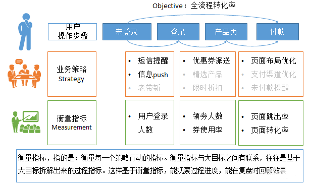

* 正向使用：在项目开始前，分解大目标，明确行动和每个行动考核指标。这是上边的例子所演示的工作流程。如果企业数据驱动氛围很好，理应这么工作
* 反向使用：项目前期没有做啥筹备，事后复盘发现一堆问题。这时候想要检讨为啥做烂了，也能按这个思路，把项目中做的事一一梳理出来，看这些事能影响什么子指标，实际影响到了没有，这些子指标和大目标之间有啥联系

# 用户画像

参考: [绝大多数互联网公司的立身之本|Stone带你深入了解用户画像](https://www.bilibili.com/video/BV13y4y1m7F1/?spm_id_from=333.999.0.0&vd_source=6410836f314e170bcf71b89c67ec8878)  

**目的**: 完成除了基本信息以外对用户进行更细粒度的划分, 完成视频推荐的精准投送

## 收集数据

### 基本属性

名字生日性别地区啥的, 注册的时候就可以拿到  

### **数据埋点**才能获得的数据

支持向量机, 聚类

1. 交易类数据
   1. 客单价, 最终成交率, 流失率, 以及转化率
   2. 在特定时段有较为大量的交易金额, 频繁的交易行为
2. 行为类数据
   1. 页面浏览量, 页面停留时长
   2. 弹幕, 点赞, 评论, 分享
3. 偏好类数据(一般和行为类数据一起去讨论)
   1. 品牌偏好
   2. 兴趣偏好

## 从那些维度拆分用户/研究用户画像的时候会采取哪些指标

要与公司背景以及具体的业务相结合

电商公司: 关注在这个电商网站最终的下单量, 成交量, 转化率

## 研究用户画像流程

**电商公司**:

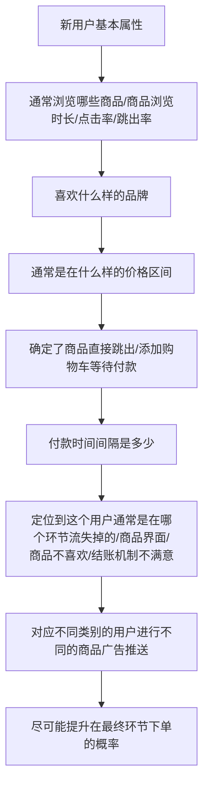

## 回答技巧

代入性法则: 把自己当成用户, 自己在使用的时候会有什么样的行为, 偏好, 哪些指标可以细致完整的把自己刻画出来, 来完善答案

# 数据埋点

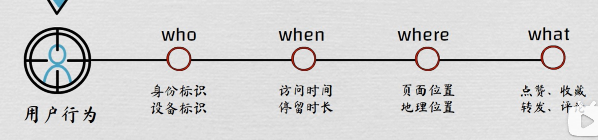