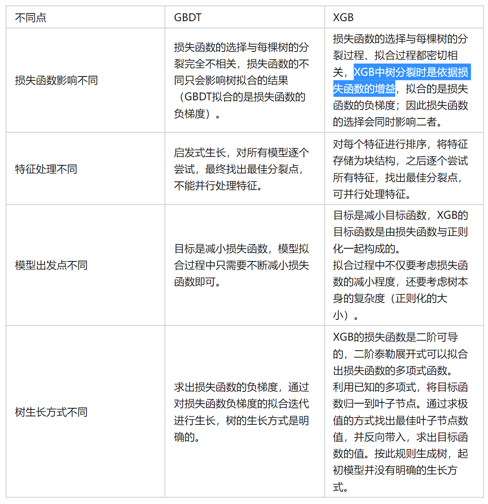
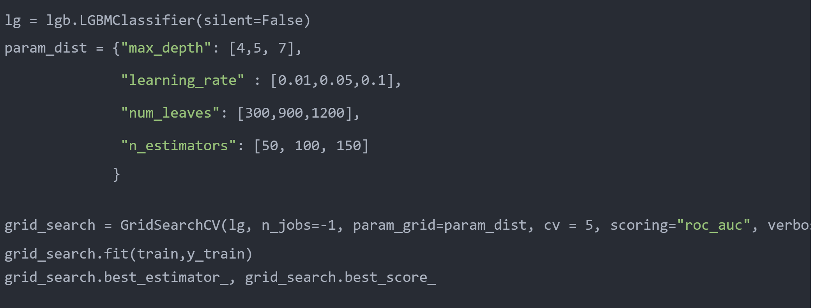
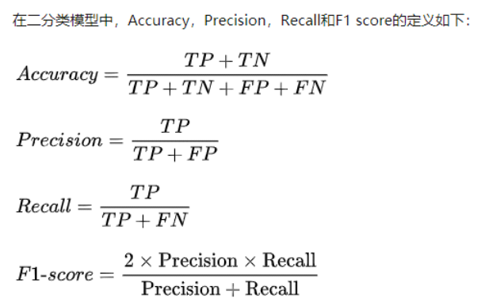
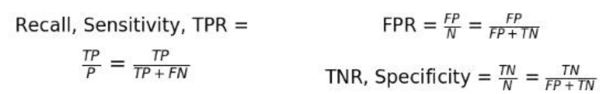
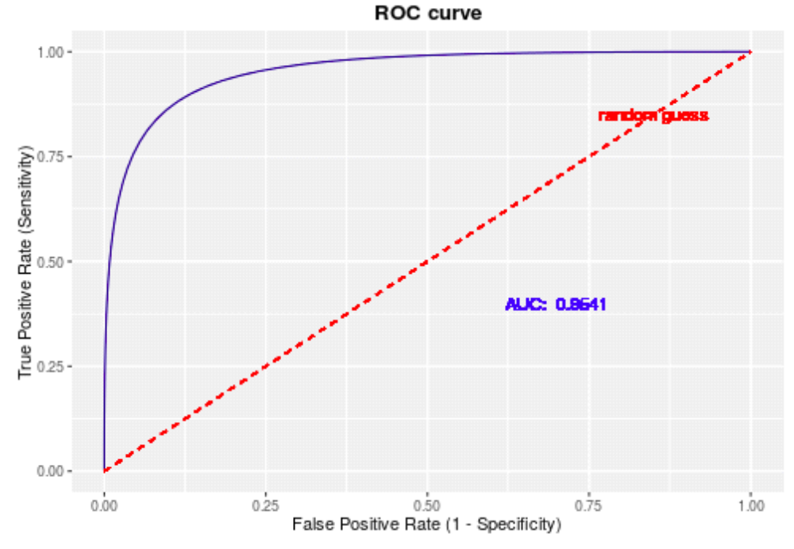
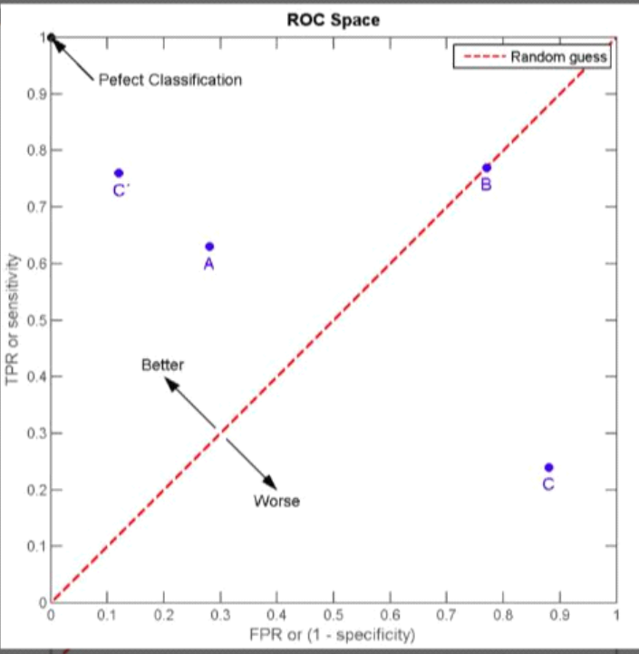
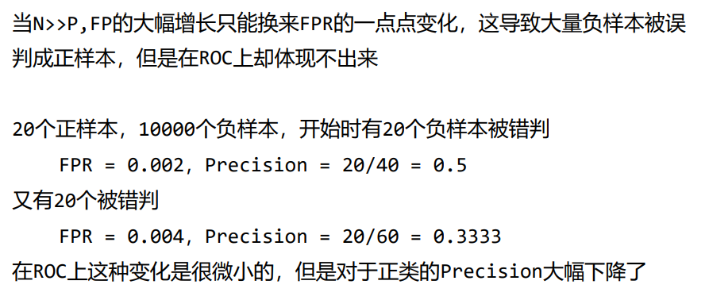

* (机器学习)特征工程
* (机器学习)用到的指标：AUC、召回率、ACC
* (机器学习)GBDT、XGBoost、多种模型融合方式
* (机器学习不平衡数据: 欠采样、过采样、SMOTE?这个看一看
* (机器学习)集成学习的方法与区别简述
* (机器学习)互信息的计算公式
* (机器学习)李航树模型的一系列公式
* (机器学习)GBDT 和 XgBoost 的区别是什么呢？(不全，还需要补充)
XgBoost 是 GBDT 的一个工程实现。1）在树的构建过程中加入了一些并行技巧；2）GBDT 本身是没有预剪枝等过程的，XgBoost 在构建的过程中加入了一些正则，起到了缓解过拟合的作用。
* `LDA`和`PCA`的区别：LDA是一种有监督的降维算法，其基本思想是让同一类样本降维之后尽可能的聚在一起，不同类的样本尽可能地分散。然后又简单说了一下公式
* 相对熵的公式、常见的一些公式
# 优秀文章！
[DW: 数据科学竞赛：你从未见过的究极进化秘笈！](https://mp.weixin.qq.com/s/pijp7pASWM9awUgt12Y3fg)
# 各种评价指标
AUC

# 特征工程
为什么要做特征工程：
在我们解决一个机器学习问题时**输入机器学习模型的数据必须是标准的向量形式**但当我们处理现实世界的数据时，数据并不会以格式规范的特征向量的形式呈现在我们面前。相反，呈现给我们的数据是数据库记录、**时间序列、图像、音频、文字等形式，同时还存着在大量的噪声数据。**所以我们需要一定的方法把**非结构化的数据转化为结构化的数据。**
# GBDT一条线
* 决策树为什么作为基学习器
（1）可解释性强；
（2）不需要做太多特征工程；
（3）对不均衡样本有鲁棒性；
（4）决策树的表达能力和泛化能力可以通过调节树的层数来折中；
（5）在决策树节点分裂的时候，可以随机选择一个特征子集，很好地引入了随机性。
## GBDT
[树模型比较好的总结博客](https://www.cnblogs.com/zichun-zeng/p/6296820.html)
## XGBoost
* xgb和gbdt区别?
基本是必考题目，从主要的优化点说起，xgb是二阶泰勒展开，gbdt是一阶，可以类比牛顿法和梯度下降法的区别，牛顿法收敛更快，但是由于更快逼近目标，会增大过拟合风险，因此在目标函数里有一个显示的惩罚项，与叶子节点数和叶子节点的权重有关，来控制模型复杂度；另外还有分裂节点的选择，xgb怎么选取最优分裂节点，有哪些加速的优化之类的知识

## LightGBM
[参数说明](https://www.huaxiaozhuan.com/%E5%B7%A5%E5%85%B7/lightgbm/chapters/lightgbm_usage.html)
LightGBM是基于XGBoost的一款可以快速并行的树模型框架，内部集成了多种集成学习思路，在代码实现上对XGBoost的节点划分进行了改进，内存占用更低训练速度更快。
### LightGBM调参经验
调参
* 加快训练速度: 
  * bagging: `bagging_fraction` and `bagging_freq`
  * feature sub-sampling 特征下采样: `feature_fraction `
  * `max_bin`调小
* 增强拟合效果: 
  * `max_bin`调大
  *  small `learning_rate` with large `num_iterations`
  *  large `num_leaves` (may cause over-fitting)
  *  bigger `training data`
  *  Try `dart`???表示带dropout 的gbdt
*  过拟合:
   * small `max_bin`
   * small `num_leaves`
   * Use `min_data_in_leaf` and `min_sum_hessian_in_leaf`
   * bagging: `bagging_fraction` and `bagging_freq`
   * feature sub-sampling 特征下采样:`feature_fraction `
   * 更大的数据集
   * 正则化: `lambda_l1`, `lambda_l2` and `min_gain_to_split`
   * 避免树更深的生长 `max_depth`
   * `extra_trees`???
   * increasing `path_smooth`???

### LightGBM网格搜索

# ACC/Precision/Recall/F1

医院开发的AI诊断系统，将病人得了癌症定义为Positive,没得癌症定义为
Negative
Precision回答的问题是：所有判断为癌症的病人中真的得了癌症的比例
Recall回答的问题是：所有癌症患者中，被检测出癌症的比例
注重Precison——当FP代价很高的时候，【将正常邮件误检为垃圾邮件】
注重Recall——当FN代价很高的时候【将癌症患者检测为健康】
F1-score是Precision和Recall的调和平均
更形象：不放过一个坏人【提高Recall】，也不冤枉一个好人【提高
Precision】

# ROC/AUC/PR
## ROC

ROC用于二分类问题中的模型比较，主要表现为一种真正例率（True Positive Rate）和假正例率的(False Positive Rate)权衡,即真阳性和假阳性的权衡。

在不同分类与之下设定分别以TPR为纵轴，FPR为横轴作图
$TPR = TP / P, FPR = FP / N$
对于一个样本，如果它被判为正类：
* TP，则TPR上升
* FP，则FPR上升

由此ROC随着阈值的增加或者减少，TPR和FPR之间是对抗的，曲线越靠近左上角，说明越多的正类样本被判为正，越少的负类样本判为正
* ROC的对角线
如果ROC曲线是对角线，则说明随着阈值的增加或者减少，分类器对于正样本属于一种随机猜测的状态，因为对角线上任意一点都说明，正类样本被判为正的概率，和负类样本被判为正的概率是一样的，起不到区分作用，分类器效果差的一批
* ROC某点的意义
A点：正样本里有0.65被判为正，负样本里有0.3被判为正
B点：正样本里0.75被判为正，负样本里0.75被判为正

* ROC的绘制
假设有P个正例, N个负例, 分类输出对所有样本预测为正类的概率$[p_1, p_2, ...,p_{P+N}]$

将概率按照降序排列为$[p_{(p+N)},...,p_{(1)}]$，将分类阈值从1降到0
* 当分类阈值为1的时候, 说明所样本都被判为负类，TPR=0，FPR=0
* 分类阈值依次取降序概率，这样每次阈值的下降都会多一个样本被判为正类
  * 正样本被判为正，则TP+1,TPR+1/P
  * 负样本被判为正，则FP+1,FPT+1/N
## AUC
ROC曲线围成的面积就是AUC，随机分类器的AUC是0.5
* AUC的意义

AUC越大，说明ROC越靠近左上角，模型分类效果越好
AUC可以理解为，**随机抽取一个正样本A，随机抽取一个负样本B，分类器将A判断为正的概率大于分类器将B判断为正的概率的可能性**
由于ROC画图的时候都是依照概率排序，AUC越大说明分类器对于样本的排序能力越好，也就是**区分正样本负样本的能力越好**

## ROC的优缺点:
* 优点
兼顾了正类和负类，FPR专注于负类，TPR专注于正类，因此可以比较均衡评估分类器性能
TPR和FPR都不依赖于具体的类别分布【对于不均衡分布有鲁棒性】
ROC的鲁棒性：在类别分布发生明显改变的情况下仍然能够客观的识别出较好的分类器【我们用ROC主要用来评估分类器的好坏，对于不均衡样本，ROC往往不能客观地给出模型的表现，也就是说0.85的AUC也不能说明分类器就牛逼，**但是可以说比其他分类器更牛逼**】
* 缺点

如果我们主要关心对正类的预测准确性，ROC就不能很好的衡量【因为不随着样本类别分布发生太大变化】
类别不平衡的情况下，ROC是一个较为乐观的估计
