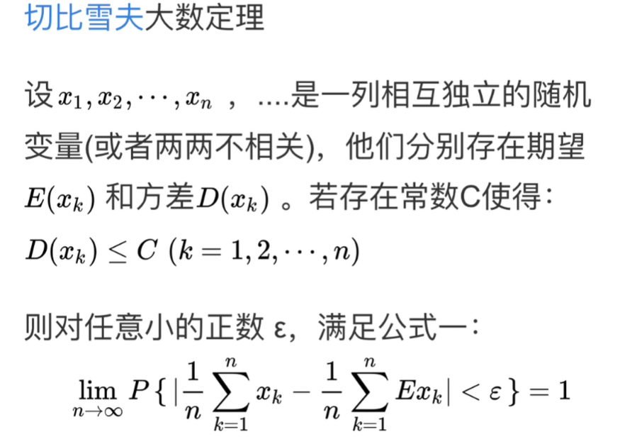
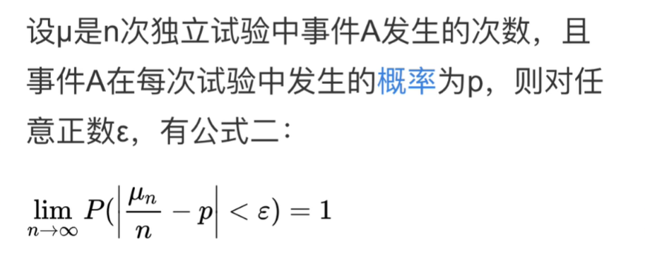
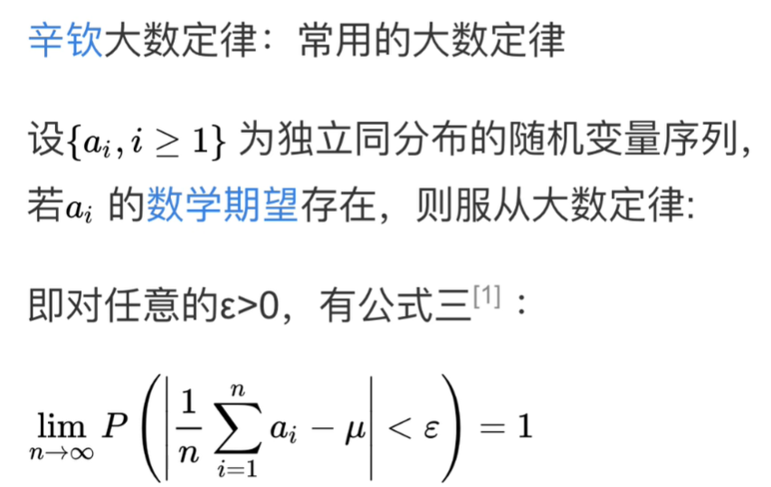
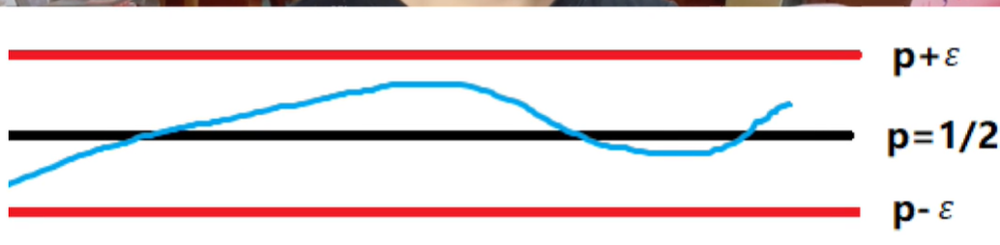
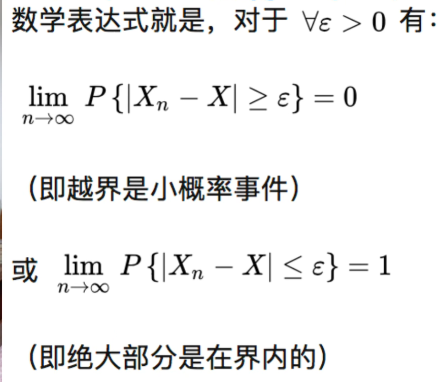
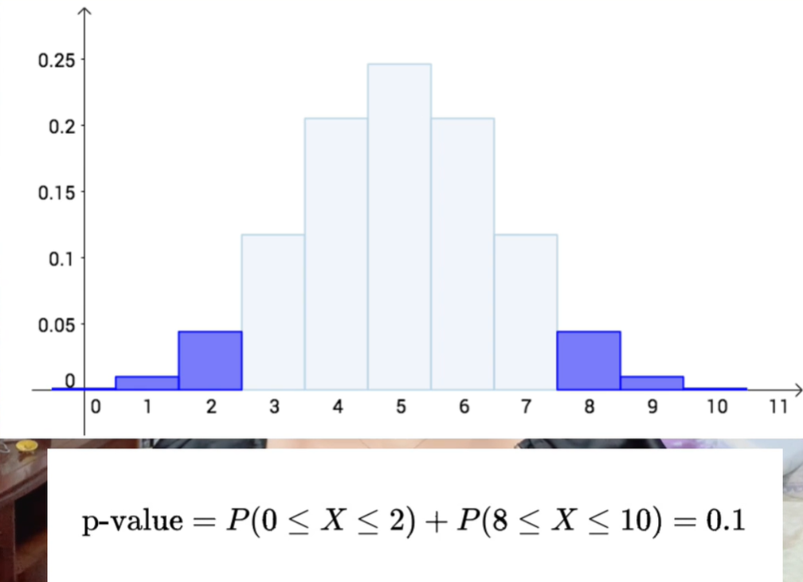

* (概率论)几何分布、伯努利分布\能不能计算一下 E(z)E(z)的数学表达式
* (概率论)[常见分布期望方差推导](https://zhuanlan.zhihu.com/p/145615691)
# 1.大数定律和中心极限定律
* 大数定律
  * 定义了频率和概率之间的联系
  * 样本**均值**会无限收敛到总体的均值(期望)
  1. 切比雪夫大数定律(无要求)
     1. 样本的均值收敛于总体的均值
     2. 
  2. 伯努利大数定律(iid, 方差有上界)
     1. 独立同分布实验下，频率依概率收敛到概率
     2. 
  3. 辛钦大数定律(iid, 期望存在)
     1. 常用
     2. 均值收敛期望 
* 中心极限定理
  * 具体的给出了在多采样和大样本的情况下会逐渐满足的具体分布形式，即正态分布
* 小数定律
  * 样本量很小、统计数据不够大的情况下和期望没啥关系，波动很大
* 依概率收敛
  * 
  * 

# 2.P值
## 2.1 假设检验
基本思想: 验证性的数据分析，提出一个假设的理论，再做实验去采集一些样本的数据去验证我们提出的这个假设，验证有效接收原假设
## 2.2 P值
定义: 当原假设为真时, 出现**观察样本**以及比所得到的观察样本结果更极端的结果出现的概率。(下图是十次，有8次正面, 以及更极端的)
  * 越小越拒绝原假设
  * 越小说明离谱程度还能提升的幅度越小，也就是已经很离谱了

# 3.分布函数
常见分布以及分布的特性??
* 指数分布无记忆性