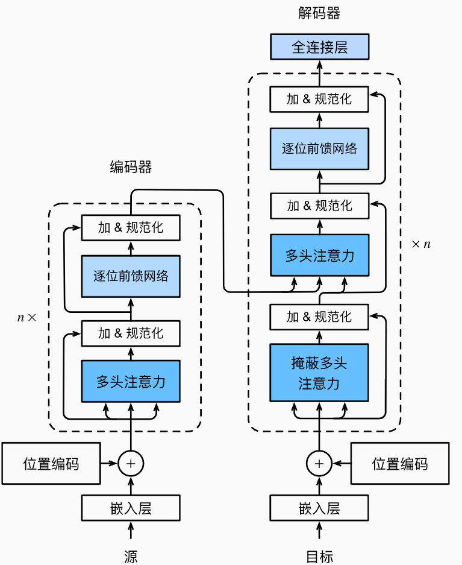
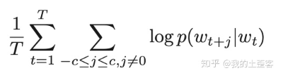
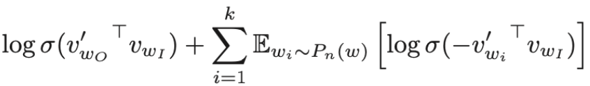
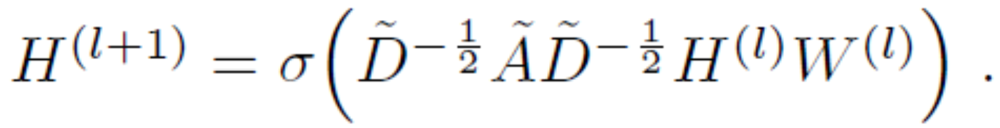
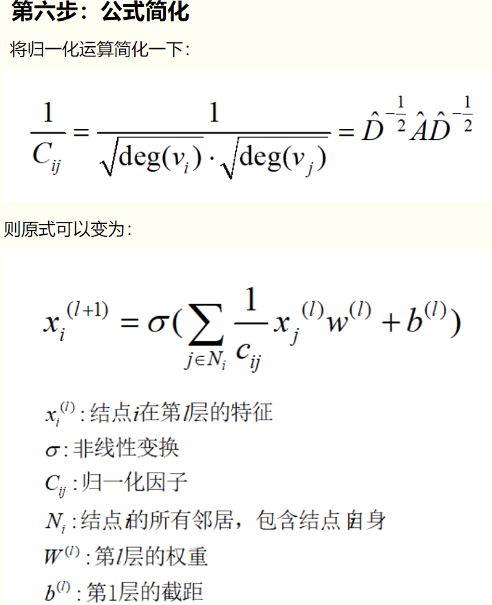

* (深度学习)ResNet 的结构特点以及解决的问题是什么？：ResNet 之前，大多认为深度越深，性能越好实际上不是，会出现信息消逝的情况。ResNet 提出了“捷径”概念，将浅处的输出牵到深处，形成一个残差，相当于把信息又往深了传递了一下。
* (深度学习)了解 BN 吗？：为了解决网络中数据分布变化大，学习过程慢的问题。采用标准化，又引入两个可学习的参数来重建浅层网络学到的分布
* (深度学习)(图神经网络)知识图谱?GCN/GAT的思想
* `Batch Normalization`是什么意思
* dropput
    * 说一下我的理解。首先假设一层神经网络中有n个神经元，其中一个神经元的输出是x，输出期望也是x。加上dropout后，有p的概率这个神经元失活，那么这个神经元的输出期望就变成了(1-p)*x+p*0=(1-p)x，我们需要保证这个神经元在训练和测试阶段的输出期望基本不变。那么就有两种方式来解决：
    第一种在训练的时候，让这个神经元的输出缩放1/(1-p)倍，那么它的输出期望就变成(1-p)x/(1-p)+p*=x，和不dropout的输出期望一致；
    第二种方式是在测试的时候，让神经元的输出缩放(1-p)倍，那么它的输出期望就变成了(1-p)x，和训练时的期望是一致的。
    * Dropout为什么需要进行缩放的解释跟学术上的解释差异很大，dropout在学术上是作为bagging方法的近似，训练的时候是对子网络的训练，预测时是对子网络的ensemble。如果按照arithmetic mean来解释dropout的话，神经元参与到集成的概率为p，所以需要对神经元的结果乘以p。

## 序列模型
### tansformer

* transformer的优点
  1. 可以直接计算每个词之间的相关性，不需要通过隐藏层传递
  2. 可以并行计算，可以充分利用GPU资源
* transformer的缺点
  1. 局部信息的获取不如RNN和CNN强
    * 因为self-attention主要关注全局信息
  2. 位置信息编码存在问题——在使用词向量的过程中，会做如下假设：对词向量做线性变换，**其语义可以在很大程度上得以保留**，也就是说词向量保存了词语的语言学信息（词性、语义）。然而，**位置编码在语义空间中并不具有这种可变换性，它相当于人为设计的一种索引**。那么，将这种位置编码与词向量**相加，就是不合理的**，所以**不能很好地表征位置信息？？。**
  3. 顶层梯度消失——即层归一化模块位于两个残差模块之间。因此，最终的输出层与之前的 Transformer 层都没有直连通路，梯度流会被层归一化模块阻断？？。

### word2vec
* skip-gram模型的目标函数

脑补一个skip-gram的训练过程，问下自己这些字母符号都是什么含义：假设训练文本有T个词，第一个求和就像一个指针从第一个词一直指到最后一个词，每个被指到的词都是就是当前词（或称中心词）；再看第二个求和符合，c是一个固定的参数，代表中心指针向前或向后能取到多少个词，换句话说，c划定了上下文的范围。那么把前两个求和符合连在一起，就有了一个浮窗（window）从第一个词一直滑到最后一个词，浮窗正中间自然是当前词，前后各c个词就是其对应的上下文；回想一下上一篇文章提到的skip-gram是怎样训练的，通过中心词来预测它的上下文中的词，那么很显然求和符号后面就是这个预测概率。整个目标函数就是为了最大化log预测概率的平均值。标配版的skip-gram用softmax函数来计算该预测概率

* word2vec（也是整个词嵌入）中词典的意思：词嵌入训练的目的是为了给词分配向量，到底是给哪些词分配呢？
肯定不会是所有的词，因为你的训练文本里可能根本没见到某些词（如何计算没见过的词的词向量是个有趣的问题，这个坑我很快会在FastText的文章里填一部分）

为什么要专门讲W？因为标配版的skip-gram在实际应用中并不实用，问题就出在字母W。我们已经知道了W是整个词典的大小，带入softmax公式中会发现每一次计算都要把整个词典过一遍，计算量非常大。因此才有了negative sampling，用以减少计算量的同时期望达到近似效果。

# 图网络
1. Inductive learning：归纳式学习——graphSAGE
2. Transductive learning： 直推式学习——GCN [GCN的计算流程](https://www.cnblogs.com/denny402/p/10917820.html)
真正的Inductive学习指训练好的模型能直接适用节点变化的图进行测试or预测。GraphSAGE以及GAT方法在训练过程不涉及拉普拉斯矩阵，训练的是中心节点与周围节点的“聚合方式”，所以测试集or预测集节点变化的情况模型也能够适用，因此属于Inductive学习。本质上，造成GCN与GraphSAGE/GAT差异的原因是一个是谱域的卷积，一个是空间域的“卷积”。

## GCN
[GCN的计算流程](https://www.cnblogs.com/denny402/p/10917820.html)
* 依赖于邻接矩阵

<!--  -->