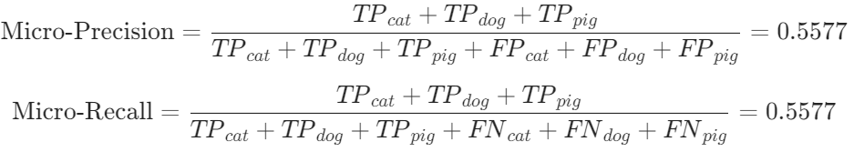

# 1. 二分类AUC、ROC、PR
## 1.1 AUC的物理意义
1. AUC的原始定义是ROC下的面积
2. 随机选出一对正负样本, 模型对正样本的打分大于对负样本打分的可能性

## 1.2 AUC的优缺点
优点:
1. 横纵坐标一个关注正类一个关注负类, **评价比较均衡**
2. 进一步, 召回率**只看正样本(分母)**, 假阳率**只看负样本**, 因此样本正负类之间的**比例**不会很大的影响AUC的值, 也就是说**对数据的不平衡分布有一定的鲁棒性**(对比PR, PR要看`精度`, 精度看的范围是所有判定为)
3. 更好的衡量一个模型的**排序**(分类)能力

缺点:
1. 没有**关注模型预测的具体概率值**
2. 无法反应**同类样本**内部的排序能力(如: 相对于下小雨, 暴雨更容易被预报出来)

## 1.3 对ROC曲线的通俗解释
首先ROC是对二分类器分类效果好坏的一种评价指标, 主要看重的是在不同分类阈值下对**召回率(真阳率)以及假阳率的权衡**. 也就是说

## 1.4.二分类指标的演变过程

* `准确率`(不平衡分布不准确) -> (针对不同场景) -> `精度`(宁放过不错杀: 垃圾邮件), `召回率`(宁错杀不放过: 初期新冠疫情、癌症、降水) -> `f1-score`(权衡二者, 防疫与过度防疫)

* `ROC`(真阳性和假阳性的权衡; 阈值的选择; 阈值放宽 -> 假阳性up, 召回率up)

* `PR`(精度和召回率的权衡; 阈值放宽 -> 召回率up, 精度down)

# 2. 多分类评价指标
对召回率和精度:
## 2.1 Macro-average方法
**直接平均**所有类别的精度和召回率, **平等的看待**每一个类别, 但是**受到稀有类别**的影响
## 2.2 Weighted-average方法
根据**样本分布加权平均**各个精度和召回率
## 2.3 Micro-average方法
将每个类别的TP, FP, FN先相加之后, 再根据二分类的公式进行计算, 其实就都是**准确率**。

* 特点: `Micro-Precision=Micro-Recall=Micro-F1 score=Accuracy`
* 相等原因: 所有错误样本 $= FP_{cat} + FP_{dog} + FP_{pig} = FN_{cat} + FN_{dog} + FN_{pig}$

## 2.4 多分类ROC