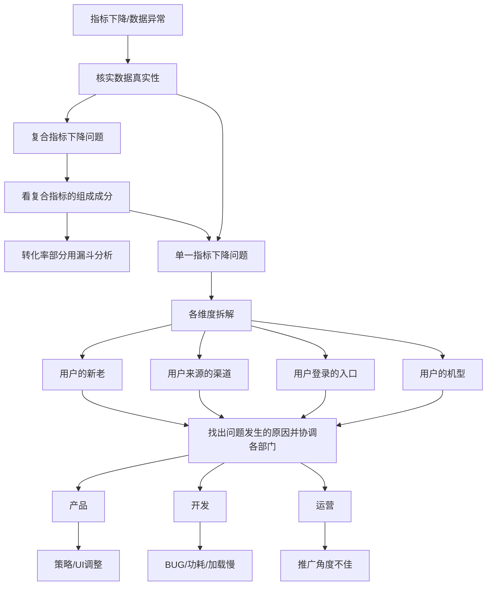

## 某个关键指标下降了(指标下降问题, 数据异常波动)应该如何去分析

参考: [这个数据分析面试中最经典的案例分析题——不会你就亏大了！](https://www.bilibili.com/video/BV16A411W7Ce/?spm_id_from=333.999.0.0&vd_source=6410836f314e170bcf71b89c67ec8878)

### 单一指标下降问题, `DAU`(Daily Active User 日活跃用户数量)下降20%

1. 核实数据的真实性(很重要! 很严重的事故, 各部门会立刻紧张起来)
   * 否则会浪费非常高的时间成本
   * 监控看板和统计系统发生bug
2. 各维度拆解(拆就完事了! 越细越好), 精准定位到问题发生的具体群体
   * 用户新老
   * 拆解用户来源的渠道(可能会和其他产品有互通: 其他产品中有我们这个产品的入口; 其他平台投放的广告)
     * 便于帮助我们分析不同渠道来源的用户质量
     * 对后续调整不同成本拉新渠道的投入成本上提供参考
   * 用户登录的入口
     * APP/PC, 对这些入口进行的改动通常是不一样的, 有一定的分析意义
   * 用户所使用的机型
     * 低端机/中低端机/中端机/高端机, 不同的机型间接反应了我们的用户质量, 不同机型播放视频的体验会很不一样
3. 找出问题发生的原因(联合各部门(产品/开发/运营), 找出原因分锅)
   * 产品: 是否有策略上发生了调整, UI设计上发生一些改动, 对于某些功能我们进行了一些变动, 从而导致用户的体验发生了差别
   * 开发: APP出现BUG, 导致出现秒退或者崩溃的情况; 功耗特别严重, 一用就没电; 接口不稳定, 网络不稳定, 页面加载过慢
   * 运营: 拉新和推送, **推广角度不佳**导致用户大量流失

### 复合指标下降问题, `GMA`(Gross Merchandise Volume网站成交金额)

融合拆解分析和漏斗分析两个主要的分析方法

1. 拆分复合指标的组成成分

   * $$GMA = UV(Unique \quad Visitor独立访客数)\times 用户转化率\times订单均价$$
     * 其中UV是单一指标
   * 用户**转化率**可以用**漏斗分析**, 用户从进入APP到最终完成购买这个动作, 在这个环节当中经历了哪些**子环节**, 不同子环节都会存在一定程度的**用户流失**, 然后再将问题定位到这个漏斗的具体子环节去看, 是不是这个子环节的功能, 界面让用户产生了体验不好的问题, 从而导致了用户的流失

### 外部原因分析

* 开学季
* 禁娱
* 政策变动导致单价下降(订单均价)

## 从那些维度拆分用户/研究用户画像的时候会采取哪些指标

要与公司背景以及具体的业务相结合
    
电商公司: 关注在这个电商网站最终的下单量, 成交量, 转化率

## (评价指标构建)给出5-10个评价搜索引擎的指标, 其中主要指标是搜索渗透率 = 用户数 / 大盘用户数

根据AARRR试试

获取用户 -> 激活用户 -> 留存 -> 收入 -> 传播

1. 用户数
   1. 
2. 大盘用户数

## 次日留存、七日留存、30日留存和长线留存意味着什么？

留存率取决于两个不同的因素:

1. 产品本身
2. 来自不同渠道的用户名

### 1. 次日留存

次日留存展示的是核心玩法的趣味性和娱乐性, 第一日期间, 大多数用户都只能体验玩法, 这是决定他们是否留下的核心理由

### 2. 七日留存

七日留存展示的是核心机制的表现情况, 体现真正的参与度如何 

## 究竟要做到多少留存率，产品才算合格

一个经典的经验数据，就是留存率的“40–20–10”规则

如果一个电商类App没有体验或者性能上的硬伤, 次日留存率30%—40%, 7日留存率大概为次日留存率一半, 30日留存率大概为7日留存率一半.
